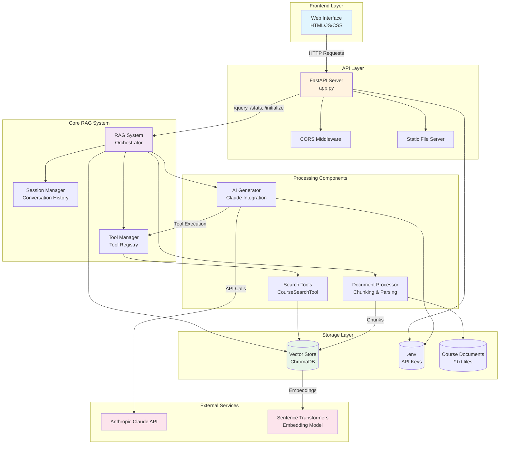
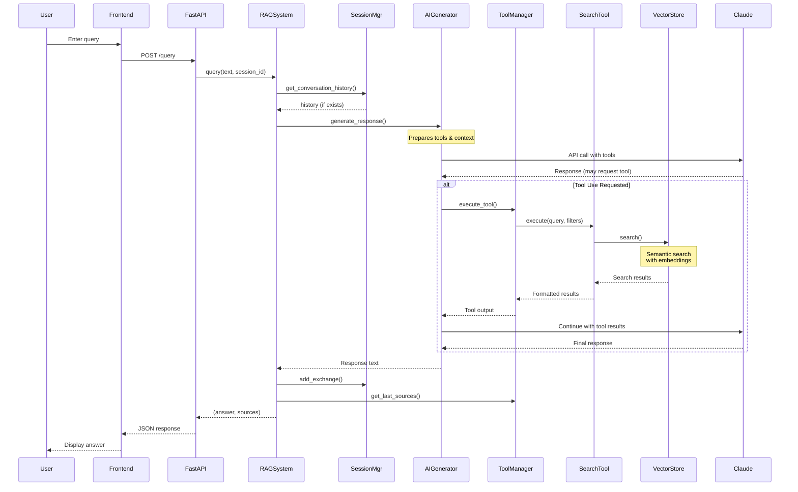
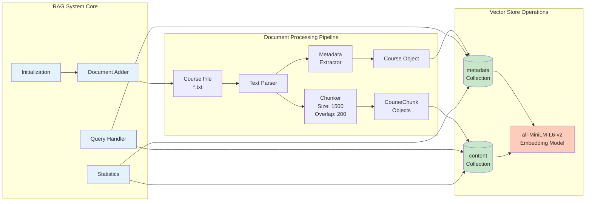
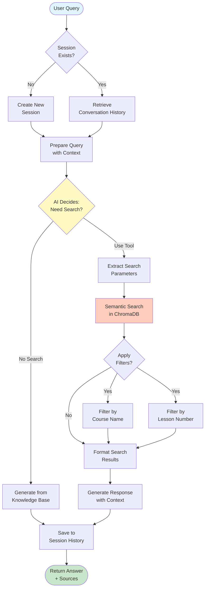
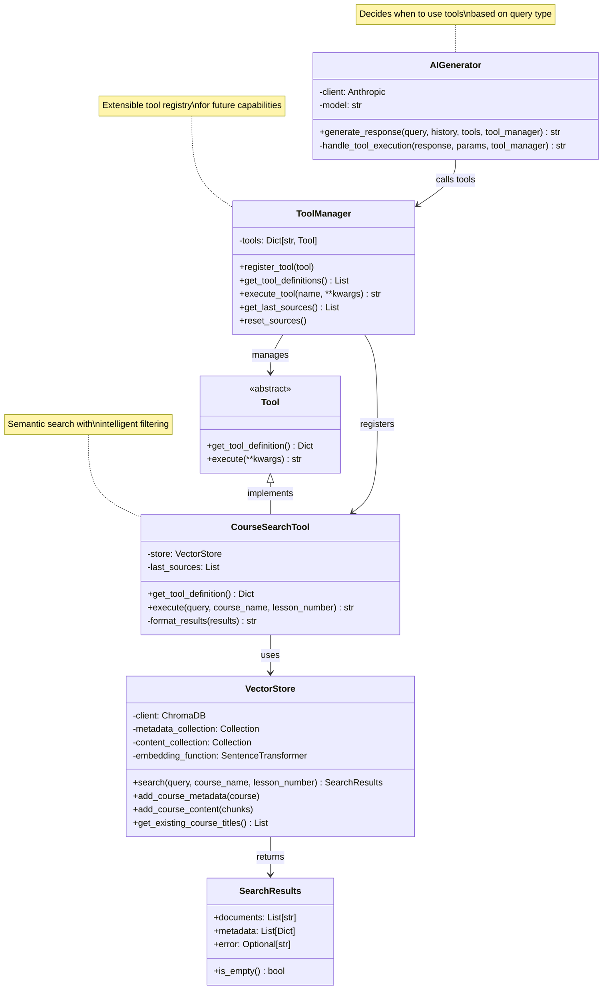
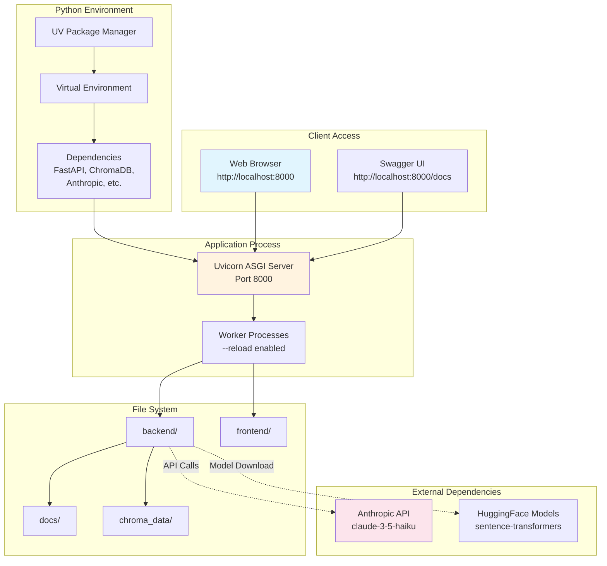
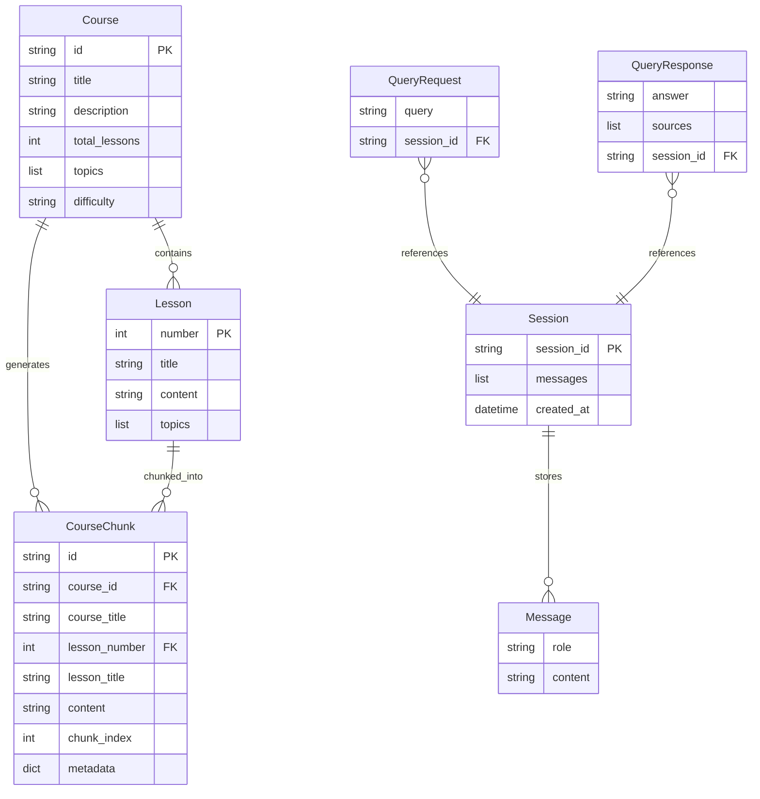

# RAG System Architecture Diagrams

## 1. High-Level System Overview

This diagram shows the complete system architecture with all major components and their interactions.

## 2. Component Interaction Flow

This diagram shows the detailed flow of a user query through the system.

## 3. RAG Subsystem Architecture

This diagram details the internal structure of the RAG system and its core components.

## 4. Query Processing Data Flow

This diagram shows how data flows through the system during query processing.

## 5. Tool-Based Search Architecture

This diagram shows the tool abstraction layer and how it enables extensible search capabilities.

## 6. Deployment Architecture

This diagram shows the deployment structure and runtime environment.

## 7. Data Model Relationships

This diagram shows the data structures and their relationships.

## Notes on Architecture

### Scaling Considerations
- **Vector Store**: ChromaDB can be replaced with production vector databases (Pinecone, Weaviate) for scaling
- **Session Management**: Currently in-memory, should use Redis/database for production
- **API Rate Limiting**: Anthropic API has rate limits - implement queuing for production
- **Embedding Cache**: Consider caching embeddings to reduce computation

### Fault Tolerance
- **Graceful Degradation**: System can answer general questions if vector search fails
- **Session Isolation**: Each session is independent, preventing cascade failures
- **Error Handling**: All components have try-catch blocks with fallback responses

### Dependencies
- **Critical**: Anthropic API key (required for AI generation)
- **Important**: ChromaDB for vector storage (can be swapped)
- **Flexible**: Sentence-transformers model (can use different models)

### Security Considerations
- API keys stored in `.env` file (not in code)
- CORS configured for controlled access
- Input validation on all endpoints
- No direct file system access from frontend